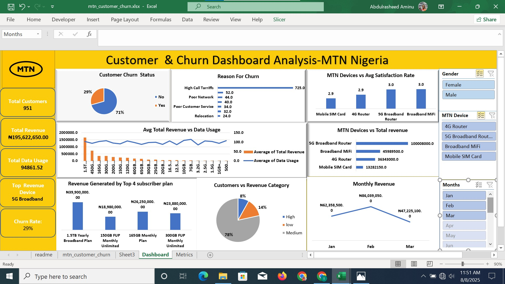

# MTN Customer Churn Analysis & Business Recommendations (Excel | Power Query | Pivot Tables)

An interactive **Customer Churn Analysis Dashboard** built in **Microsoft Excel** to identify customer retention challenges, analyze churn drivers, and provide actionable business recommendations. The dashboard leverages **Power Query**, **Pivot Tables**, **Pivot Charts**, and **Slicers** to transform raw customer data into meaningful insights for business decision-making.

---

# 📌 Project Overview

Customer retention is one of the most important drivers of profitability in the telecommunications industry. Acquiring new customers is significantly more expensive than retaining existing ones.

This project analyzes MTN customer data to identify:

- Customer churn patterns
- Primary reasons customers leave
- Revenue contribution by device and subscriber plan
- Customer satisfaction across devices
- Monthly revenue trends
- Customer revenue segmentation

The dashboard enables business stakeholders to interactively explore customer behavior and identify opportunities to improve customer retention and maximize revenue.

---

#  Business Objective

The primary objective of this project is to analyze customer churn patterns and uncover the major factors contributing to customer loss.

The analysis aims to help management:

- Reduce customer churn
- Improve customer satisfaction
- Increase customer retention
- Optimize marketing strategies
- Improve service quality
- Maximize customer lifetime value

---

#  Key Performance Indicators (KPIs)

| KPI | Value |
|------|---------|
| Total Customers | **951** |
| Customers Retained | **675 (71%)** |
| Customers Churned | **276 (29%)** |
| Churn Rate | **29%** |
| Total Revenue | **₦195,622,650** |
| Total Data Usage | **94,861.52 GB** |
| Top Revenue Device | **5G Broadband Router** |

---

#  Dashboard Preview



---

# 🔍 Business Questions Answered

- What percentage of customers churned?
- What are the leading reasons for customer churn?
- Which MTN devices generate the highest revenue?
- Which subscriber plans contribute the most revenue?
- How satisfied are customers across different devices?
- How does revenue change over time?
- Which customer revenue segment generates the most income?
- How does data usage compare with revenue?

---

#  Tools & Skills Used

- Microsoft Excel
- Power Query
- Pivot Tables
- Pivot Charts
- Slicers
- Excel Formulas
- KPI Development
- Dashboard Design
- Data Cleaning
- Data Transformation
- Exploratory Data Analysis (EDA)
- Business Intelligence
- Customer Analytics
- Data Visualization

---

#  Project Workflow

## 1. Data Collection

- Imported customer churn dataset in CSV format.
- Loaded the dataset into Microsoft Excel for preprocessing and analysis.

---

## 2. Data Cleaning (Power Query)

Performed multiple preprocessing tasks including:

- Removed duplicate records
- Handled missing values
- Corrected inconsistent formatting
- Standardized column names
- Converted data types
- Validated customer information
- Prepared data for analysis

---

## 3. Exploratory Data Analysis (EDA)

Analyzed customer behavior using:

- Pivot Tables
- Pivot Charts
- Interactive Filters
- KPI Cards

The analysis focused on:

- Customer retention
- Revenue distribution
- Device performance
- Churn reasons
- Customer satisfaction
- Monthly revenue trends

---

## 4. Dashboard Development

Designed an interactive dashboard containing:

- KPI Cards
- Pie Charts
- Column Charts
- Bar Charts
- Line Charts
- Interactive Slicers

Users can dynamically filter the dashboard by:

- Gender
- Device
- Month

---

#  Key Business Insights

##  Customer Churn Status

- Out of **951 customers**, **276 customers (29%)** have churned, while **675 customers (71%)** remain active.
- Although the majority of customers are retained, a churn rate of **29%** is relatively high for a telecommunications business and represents a significant revenue risk.

**Business Insight**

Reducing churn by even a small percentage could substantially improve customer lifetime value and overall profitability.

---

##  Top Reasons for Customer Churn

The analysis identified the primary drivers of customer churn:

1. **High Call Tariffs** (largest contributor)
2. Poor Network Quality
3. Poor Customer Service
4. Relocation
5. Expired SIM

**Business Insight**

Pricing remains the biggest factor influencing customer retention, followed by service quality and network reliability.

---

##  Device Performance

Revenue generated by MTN devices shows that:

- **5G Broadband Router** generates the highest revenue.
- Broadband MiFi follows as the second-best performing device.
- Mobile SIM Cards contribute the lowest revenue.

**Business Insight**

Customers adopting broadband devices generate significantly higher revenue than traditional mobile subscribers.

---

##  Customer Satisfaction by Device

Average customer satisfaction scores range from **2.9 to 3.0**, indicating relatively consistent satisfaction across devices.

- 5G Broadband Router and Broadband MiFi recorded the highest average satisfaction.
- Mobile SIM Cards received comparatively lower satisfaction scores.

**Business Insight**

Maintaining service quality for premium broadband devices will help retain high-value customers.

---

##  Revenue by Subscriber Plan

The highest revenue-generating plans include:

- **1.5TB Yearly Broadband Plan**
- **165GB Monthly Plan**
- **300GB Monthly Unlimited**
- **150GB FUP Monthly Unlimited**

**Business Insight**

Customers prefer larger data bundles, suggesting strong demand for high-capacity internet plans.

---

##  Customer Revenue Segmentation

Revenue segmentation shows:

- **78%** of customers belong to the Medium Revenue category.
- **14%** belong to the Low Revenue category.
- Only **8%** belong to the High Revenue category.

**Business Insight**

Most customers generate moderate revenue, presenting opportunities to upsell them into premium plans.

---

##  Revenue vs Data Usage

Revenue generally increases with higher data usage, although some plans deliver stronger revenue despite lower consumption.

**Business Insight**

Premium pricing strategies can be optimized by aligning plan pricing with customer usage behavior.

---

##  Monthly Revenue Trend

Monthly revenue peaked in **February**, followed by a decline in **March**.

**Business Insight**

The February increase may have been driven by promotional campaigns, seasonal demand, or customer acquisition activities. Further investigation is recommended to understand the subsequent decline.

---

# 💡 Business Recommendations

Based on the analysis, the following recommendations are proposed:

### 1. Review Call Tariffs

Since high call tariffs are the leading reason for churn, MTN should review pricing strategies and introduce more competitive voice and data bundles.

---

### 2. Improve Network Quality

Invest in network infrastructure to reduce connectivity issues and improve customer experience, particularly in high-traffic areas.

---

### 3. Strengthen Customer Support

Enhance customer service responsiveness by reducing resolution times and improving first-contact resolution rates.

---

### 4. Promote Premium Broadband Plans

Expand marketing efforts for high-performing broadband devices and premium data plans to increase average revenue per user (ARPU).

---

### 5. Launch Customer Retention Campaigns

Identify customers at risk of churning and implement proactive retention initiatives such as:

- Loyalty rewards
- Personalized offers
- Bonus data packages
- Contract renewal incentives

---

### 6. Upsell Medium-Value Customers

Since the majority of customers fall within the medium revenue segment, targeted promotions can encourage upgrades to higher-value plans.

---

### 7. Monitor Customer Satisfaction

Regularly collect customer feedback and monitor satisfaction scores to identify issues before they result in churn.

---

#  Skills Demonstrated

- Data Cleaning
- Data Transformation
- Exploratory Data Analysis (EDA)
- Customer Churn Analysis
- Customer Segmentation
- KPI Development
- Dashboard Design
- Data Visualization
- Business Intelligence
- Pivot Tables
- Power Query
- Excel Reporting
- Business Storytelling
- Data-Driven Decision Making

---

# 📂 Repository Structure

```text
├── mtn_customer_churn.xlsx
├── mtn.jpg
├── README.md
```

---

#  Future Improvements

- Build a predictive churn model using Machine Learning.
- Develop a Power BI version with advanced drill-through functionality.
- Incorporate customer demographics and tenure analysis.
- Add Customer Lifetime Value (CLV) analysis.
- Build an automated monthly churn monitoring dashboard.

---

#  Author

**Aminu Abdulrasheed**

**Data Analyst | Business Intelligence | AI & Digital Innovation**

📧 Email: aminuabdulrasheed055@gmail.com
📺 YouTube: https://www.youtube.com/@AminuAnalyst

---

⭐ If you found this project useful, consider giving the repository a **Star**.
